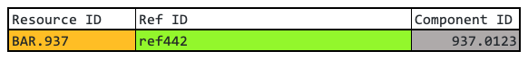

## ArchivesSpace Work Orders and Digitization

ArchivesSpace work orders contain information required to properly  
name digital object directories and files.  This name is the "digitization  
identifier", or `digi_id`.  

DLTS uses the `digi_id` to look up the ArchivesSpace archival object URI  
which is required to load persistent URLs for the digital objects into  
ArchivesSpace.

**It is critical**, therefore, that the `digi_id` is generated from the  
information in the ArchivesSpace work order, and that the   
**digital object directory name** matches the `digi_id`.

**The project manager (PM) and the Digitization Team (DT) should  
agree on the `digi_id` form before digitization begins.**


## ArchivesSpace Work Orders
ArchivesSpace work orders have the following fields:

| Resource ID | Ref ID | URI | Container Indicator 1 | Container Indicator 2 | Container Indicator 3 | Title | Component ID |
|-------------|--------|-----|-----------------------|-----------------------|-----------------------|-------|--------------|

In the examples below, only the three columns used to form  
`digi_id`s will be shown:

| Resource ID | Ref ID | Component ID |
|-------------|--------|--------------|
<br>

## Generating the `digi_id`
The `digi_id` is formed by following a simple template:  
#### `digi_id = <prefix>_<suffix>`  
<br>

#### the `prefix`:
The `prefix` can be any string of characters that conforms to the rules  
outlined [here](./README.md#characters-allowed-in-directory-names-and-file-names),  but is is usually based on **ONE** of the following:
* the work order `Resource ID` 
* the concatenation of the DLTS Repository `partner code` and `collection code`
* a string of characters selected by the PM and DT
<br>

#### the `suffix`:
The `suffix ` comes from the ArchivesSpace work order and  
**MUST be ONE of the following**  
* the `Component ID` 
* the `Ref ID` 
<br>


## Examples:  
The following examples show `digi_id`s generated using various `prefixes`\.   
Angle brackets `< >` indicate where actual values need to be substituted to  
form the `digi_id`.  

Legend:  


---

#### Example 1:  `digi_id` = `<Normalized Resource ID>_<Component ID>`


`prefix` = `XY_MC_099` (`Resource ID` value normalized per [these rules](./README.md#characters-allowed-in-directory-names-and-file-names).)  
`Component ID` = `abc10_000001`  

`digi_id`: **`XY_MC_099_abc10_000001`**

**directory structure:**
```
   XY_MC_099_abc10_000001/
                          XY_MC_099_abc10_000001_000001_m.tif
                          XY_MC_099_abc10_000001_000001_d.tif
                          XY_MC_099_abc10_000001_000002_m.tif
                          XY_MC_099_abc10_000001_000002_d.tif
                          ...
```
---

#### Example 2:  `digi_id` = `<Normalized Resource ID>_<Ref ID>`  



`prefix` = `BAR_937` (`Resource ID` value normalized per [these rules](./README.md#characters-allowed-in-directory-names-and-file-names).)  
`Ref ID` = `ref442`   

`digi_id`: **`BAR_937_ref442`**

**directory structure:**
```
   BAR_937_ref442/
                  BAR_937_ref442_000001_m.tif
                  BAR_937_ref442_000001_d.tif
                  BAR_937_ref442_000002_m.tif
                  BAR_937_ref442_000002_d.tif
                  ...
```

---

#### Example 3:  `digi_id` = `<partner code>_<collection code>_<Component ID>`  


`prefix` = `foo_quux876`  
`Component ID` = `cuid2594`  

`digi_id` = **`foo_quux876_cuid2594`**

**directory structure:**
```
   foo_quux876_cuid2594/
                        foo_quux876_cuid2594_000001_m.tif
                        foo_quux876_cuid2594_000001_d.tif
                        foo_quux876_cuid2594_000002_m.tif
                        foo_quux876_cuid2594_000002_d.tif
                        ...
```

---

#### Example 4:  `digi_id` = `<prefix selected by PM and DT>_<Component ID>`


`prefix` = `vxt_MSSLaScala001`  
`Component ID` = `cuid50`  

`digi_id` = **`vxt_MSSLaScala001_cuid50`**


**directory structure:**
```
   vxt_MSSLaScala001_cuid50/
                           vxt_MSSLaScala001_cuid50_000001_m.tif
                           vxt_MSSLaScala001_cuid50_000001_d.tif
                           vxt_MSSLaScala001_cuid50_000002_m.tif
                           vxt_MSSLaScala001_cuid50_000002_d.tif
                           ...
```

---

*end of examples*
