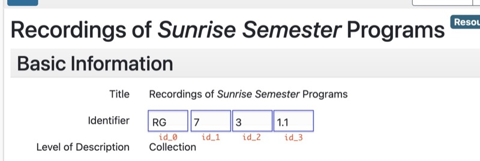

## Preservation Media Lab A/V naming template

### Current Template:  

Given the following resource in ArchivesSpace:



And this template:
```
  <pc>_<id_0><id_1>[-<id_2>][-<id_3>]_<cuid value>
  
  (note that there is no delimiter between id_0 and id_1)
```
```
where:
 <xyz> : indicates a field to be populated with a value  
 [abc] : indicates a portion of the template that only needs to be 
         populated if the corresponding id_2 and id_3 fields have values  

and:
 <pc>   is the partner code (lowercase)
 <id_0> is the id_0 value in upper OR lower case
 <id_3> is the id_3 value with any dots (.) converted to dashes (-)
```

Then a digitization ID for an item in this collection could be:  
`using uppercase id_0 --> nyuarchives_RG7-3-1-1_cuid18795`  
or   
`using lowercase id_0 --> nyuarchives_rg7-3-1-1_cuid18795`  

---

#### NOTE:
* When creating a directory and naming content files within that directory,  
  **the beginning of the content filenames must match the directory name**.
  e.g.,
```
#--------------------------------------------------------------
# NOT GOOD:
# mismatch between directory name : tamwag_ABC123_cuid15026
#                                          ^^^
# and content-file filename prefix: tamwag_abc123_cuid15026
#                                          ^^^
#--------------------------------------------------------------
       vvv
tamwag_ABC123_cuid15026
    ├── 20120416-CASSETTE-LL2-EOC.xls
    ├── ReadMe.txt
    ├── tamwag_ABC123_20151106.xlsx
    ├── tamwag_abc123_cuid15026_000001_d.wav
    ├── tamwag_abc123_cuid15026_000001_m.wav
    ├── tamwag_abc123_cuid15026_000002_d.wav
    └── tamwag_abc123_cuid15026_000002_m.wav
               ^^^

#--------------------------------------------------------------
# GOOD: (lowercase collection code)
# match between directory name     : tamwag_abc123_cuid15026
# and content-file filename prefix : tamwag_abc123_cuid15026
#--------------------------------------------------------------
tamwag_abc123_cuid15026
    ├── 20120416-CASSETTE-LL2-EOC.xls
    ├── ReadMe.txt
    ├── tamwag_abc123_20151106.xlsx
    ├── tamwag_abc123_cuid15026_000001_d.wav
    ├── tamwag_abc123_cuid15026_000001_m.wav
    ├── tamwag_abc123_cuid15026_000002_d.wav
    └── tamwag_abc123_cuid15026_000002_m.wav

#--------------------------------------------------------------
# ALSO GOOD: (capitalized collection code)
# match between directory name     : tamwag_ABC123_cuid15026
# and content-file filename prefix : tamwag_ABC123_cuid15026
#--------------------------------------------------------------
tamwag_ABC123_cuid15026
    ├── 20120416-CASSETTE-LL2-EOC.xls
    ├── ReadMe.txt
    ├── tamwag_ABC123_20151106.xlsx
    ├── tamwag_ABC123_cuid15026_000001_d.wav
    ├── tamwag_ABC123_cuid15026_000001_m.wav
    ├── tamwag_ABC123_cuid15026_000002_d.wav
    └── tamwag_ABC123_cuid15026_000002_m.wav

```
```
A/V File Naming Template (no "Content-Split", with "version" option): 

The naming template at the time of this writing is:

    <pc>_<ci>_<aoi>[<sis>][_<fs>][_<tv>]_<fr>.<fe>

where:
    pc  = partner code
    ci  = collection identifier
    aoi = archival object ID
    sis = source item sequence identifier, e.g., first tape of a set        [optional]
    fs  = file sequence, e.g., 000001 -> tape side A, 000002 -> tape side B [optional]
    tv  = take/version indicating different attempts at digitizing an asset [optional]
    fr  = file role, e.g., master, derivative maker (mezzanine)
    fe  = file extension


|--------------------------------------+-----------+----------+----------+---------+--------+------|
|                                      |           | source   |          |         |        |      |
|                                      |           | item     |          |         |        |      |
| file name                            | archival  | sequence | file     | take/   | file   | file |
|                                      | object    | id       | sequence | version | role   | ext  |
|--------------------------------------+-----------+----------+----------+---------+--------+------|
| tamwag_TAM709_cuid168A_000001_d.wav  | cuid168   | A        | 1        | n/a     | dmaker | wav  |
| tamwag_TAM709_cuid168A_000001_m.wav  | "         | "        | "        | "       | master | "    |
|                                      |           |          |          |         |        |      |
| tamwag_TAM709_cuid168A_000002_d.wav  | "         | "        | 2        | "       | dmaker | "    |
| tamwag_TAM709_cuid168A_000002_m.wav  | "         | "        | "        | "       | master | "    |
|                                      |           |          |          |         |        |      |
| tamwag_TAM709_cuid168B_000001_d.wav  | "         | B        | 1        | "       | dmaker | "    |
| tamwag_TAM709_cuid168B_000001_m.wav  | "         | "        | "        | "       | master | "    |
|                                      |           |          |          |         |        |      |
| tamwag_TAM709_cuid168B_000002_d.wav  | "         | "        | 2        | "       | dmaker | "    |
| tamwag_TAM709_cuid168B_000002_m.wav  | "         | "        | "        | "       | master | "    |
|                                      |           |          |          |         |        |      |
| fales_mss231_cuid45678_m.mov         | cuid45678 | n/a      | n/a      | n/a     | master | mov  |
| fales_mss231_cuid45678_d.mov         | "         | "        | "        | "       | dmaker | "    |
|                                      |           |          |          |         |        |      |
| fales_mss547_cuid41188_v1_m.mov      | cuid41188 | n/a      | n/a      | take 1  | master | mov  |
| fales_mss547_cuid41188_v1_d.mov      | "         | "        | "        | "       | dmaker | "    |
|                                      |           |          |          |         |        |      |
| fales_mss547_cuid41188_v2_m.mov      | "         | n/a      | n/a      | take 2  | master | mov  |
| fales_mss547_cuid41188_v2_d.mov      | "         | "        | "        | "       | dmaker | "    |
|--------------------------------------+-----------+----------+----------+---------+--------+------|
* the "take/version" field is used to differentiate digitization passes of the same source asset.
  v1 denotes the first  attempt at digitizing the asset
  v2 denotes the second attempt at digitizing the asset
  ...
```


##
### HDV Template and Package Structure:

Notes:  

* There are multiple master files per dmaker file
* The master file index starts with `000000`

```text
tamwag_tam222_cuid24601
     ↳ 20250920-HDV_Sony_HVRM25AU-LL2-EOC.xls [environment-of-creation file]
     ↳ tamwag_tam222_cuid24601_d.mpg          [1920x1080 MPEG-2, combining all _m files]
     ↳ tamwag_tam222_cuid24601_000000_m.m2t   [native 1440x1080 MPEG-2 video clips] 
     ↳ tamwag_tam222_cuid24601_000001_m.m2t
     ↳ tamwag_tam222_cuid24601_000002_m.m2t
     ↳ tamwag_tam222_cuid24601_000003_m.m2t
     ↳ tamwag_tam222_cuid24601_000004_m.m2t
     ↳ tamwag_tam222_cuid24601_s.mp4          [1920x1080 H264, same video content as _d]
```

##
### Legacy Template:
```
"Content-Split" File Naming Template: 

* JHOVE used to fail .wav files that were larger than 4 GB. [1]
  (https://wiki.dpconline.org/images/4/46/WAV_Assessment_v1.0.pdf)

  This file-size upper limit required content to be split
  so that the .wav files would pass JHOVE validation.

  Therefore, a "content split" indicator is present in the naming template.

Template:
<partner code>_<collection identifier>_<archival object ID>_<tape side>_<content split>_<file role>.<file extension>


Example: fales/mss326:

|-------------------------+----------+--------+-------+--------+------|
| file name               | archival |  tape  |content|  file  | file |
|                         |  object  |  side  | split |  role  | ext  |
|-------------------------+----------+--------+-------+--------+------|
| 326_0003_000001_A_d.wav | 326_0003 |   1    |   A   | dmaker | wav  |
| 326_0003_000001_A_m.wav |    "     |   "    |   "   | master |  "   |
|                         |          |        |       |        |      |
| 326_0003_000001_B_d.wav |    "     |   "    |   B   | dmaker |  "   |
| 326_0003_000001_B_m.wav |    "     |   "    |   "   | master |  "   |
|                         |          |        |       |        |      |
| 326_0003_000002_A_d.wav |    "     |   2    |   A   | dmaker |  "   |
| 326_0003_000002_A_m.wav |    "     |   "    |   "   | master |  "   |
|                         |          |        |       |        |      |
| 326_0003_000002_B_d.wav |    "     |   "    |   B   | dmaker |  "   |
| 326_0003_000002_B_m.wav |    "     |   "    |   "   | master |  "   |
|-------------------------+----------+--------+-------+--------+------|

[1] The JHOVE WAV validation module now accepts files larger than 4GB,   
    so the content does not need to be split. Therefore, the  
    "Content-Split" naming template is no longer used.
```

