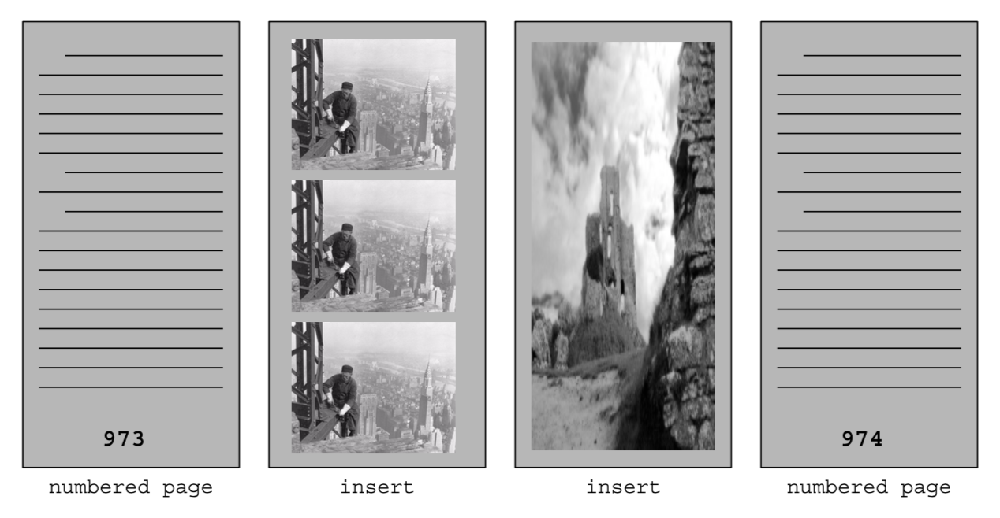
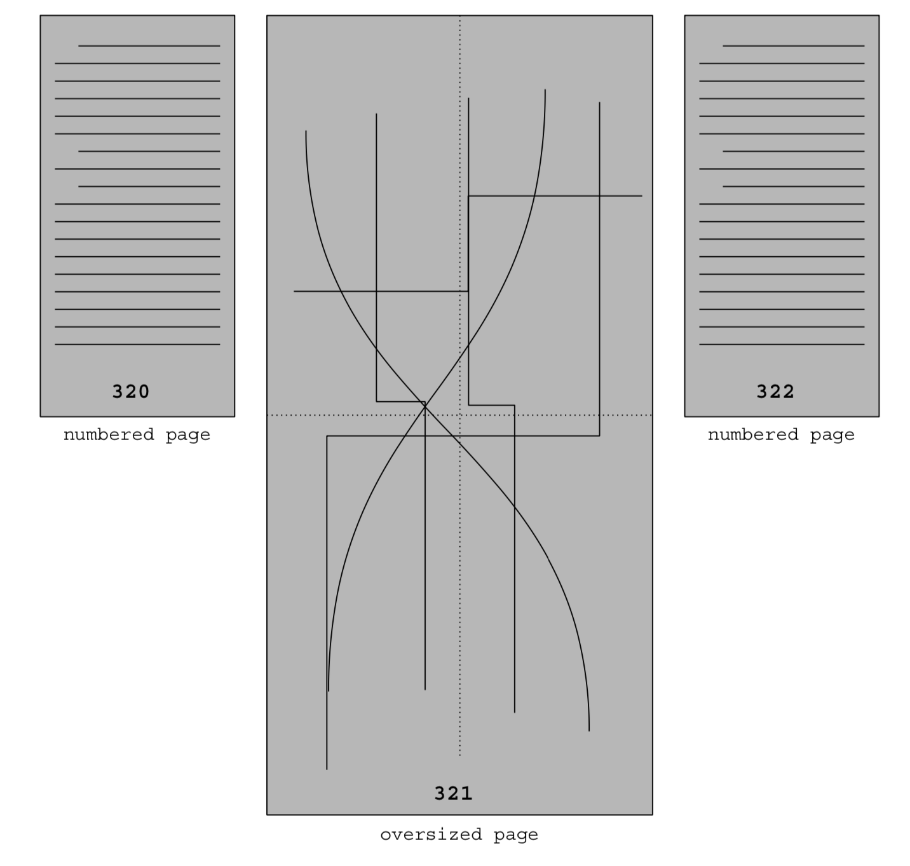

## <code>preservation</code> workflow naming template
### examples: ([template details](#template) below)
  * front matter:
    * <code>nyu_aco123456_fr01_m.tif</code>
    * <code>nyu_aco123456_fr01_d.tif</code>
    * <code>nyu_aco123456_fr157_m.tif</code>
    * <code>nyu_aco123456_fr157_d.tif</code>
  * numbered pages:
    * <code>nyu_aco123456_000123_m.tif</code>
    * <code>nyu_aco123456_000123_d.tif</code>
  * back matter:
    * <code>nyu_aco123456_bk97_m.tif</code>
    * <code>nyu_aco123456_bk97_d.tif</code>
    * <code>nyu_aco123456_bk191_m.tif</code>
    * <code>nyu_aco123456_bk191_d.tif</code>
  * inserts:
    * <code>nyu_aco123456_000973_01_m.tif</code>
    * <code>nyu_aco123456_000973_01_d.tif</code>
    * <code>nyu_aco123456_000973_02_m.tif</code>
    * <code>nyu_aco123456_000973_02_d.tif</code>
  * oversized:
    * e.g., oversized page # 321 requiring 4 <code>master</code> files
      * <code>nyu_aco123456_000321_01_m.tif</code>
      * <code>nyu_aco123456_000321_02_m.tif</code>
      * <code>nyu_aco123456_000321_03_m.tif</code>
      * <code>nyu_aco123456_000321_04_m.tif</code>
      * <code>nyu_aco123456_000321_d.tif</code>
    * e.g., oversized, two-sided insert right after page # 722 requiring  
    two <code>master</code> files per side
      * <code>nyu_aco123456_000722_01_01_m.tif</code>
      * <code>nyu_aco123456_000722_01_02_m.tif</code>
      * <code>nyu_aco123456_000722_01_d.tif</code>
      * <code>nyu_aco123456_000722_02_01_m.tif</code>
      * <code>nyu_aco123456_000722_02_02_m.tif</code>
      * <code>nyu_aco123456_000722_02_d.tif</code>  
  * session target:
    * `nyu_aco123456_target_m.tif`
  * EOC file:
    * `20160324-IQ260-EOC.csv`
    * `nyu_aco001871_eoc.csv`

### terms:
  * **numbered pages**: images of pages that have numbers printed on them
  * **front matter pages**: images of pages that precede the numbered pages
  * **back matter pages**: images of pages that follow the numbered pages
  * **insert pages**: images of pages that do not have numbers on them and   
    appear between numbered pages
  
  * **oversized pages**: images of pages that require multiple <code>master</code> files  
    to capture and the <code>master</code> files are stitched together into a single   
    <code>dmaker</code> file
  

  ### template
  * generic template: <code>&lt;digi_id&gt;_&lt;sequence number&gt;_&lt;role&gt;<b>.tif</b></code>
    * `digi_id`: the `digitization id` assigned to the `digital object`
    * `sequence number`: an integer padded with leading-zeros as needed,  
    e.g., `000007`, that indicates the order of the corresponding page  
    in the item
    * `role`: the role of the file, e.g., `master`, `dmaker`
      * use `_m` for `master` files
      * use `_d` for `dmaker` files

#### specific templates
* **numbered pages:**
  * template: `<digi_id>_<page number>_<role>`<code><b>.tif</b></code>
    * <code>page number<code>: a **six digit** integer padded with leading zeros that  
    matches the page number printed on the page
* **front matter pages:**
  * template: `<digi_id>`<code><b>\_fr</b></code>`<sequence number>_<role>`<code><b>.tif</b></code>
    * <code>sequence number<code>: a **two digit** integer padded with leading zeros
      * can use three digits when needed
* **back matter pages:**
  * template: <code>&lt;digi_id&gt;<b>\_bk</b>&lt;sequence number&gt;_&lt;role&gt;<b>.tif</b></code>
    * <code>sequence number<code>: a **two digit** integer padded with leading zeros
      * can use three digits when needed
* **inserts:**
  * template: <code>&lt;digi_id&gt;\_&lt;page number&gt;\_&lt;sequence number&gt;\_&lt;role&gt;<b>.tif</b></code>
    * <code>page number<code>: the **six digit** integer padded with leading zeros that  
    matches the last numbered page before the insert
    * <code>sequence number<code>: a **two digit** integer padded with leading zeros  
    that indicates the sequence of the page in the "insert" section
      * can use three digits when needed
* **oversized pages:**
  * <code>dmaker</code> template: <code>&lt;digi_id&gt;_&lt;page number&gt;_d.tif</code>
    * <code>page number<code>: a **six digit** integer padded with leading zeros that  
    matches the page number in the item
  * <code>master</code> template: <code>&lt;digi_id&gt;_&lt;page number&gt;_&lt;sequence number&gt;_m.tif</code>
    * <code>sequence number<code>: a **two digit** integer padded with leading zeros  
    that indicates that this is part of an oversized page
* **session target:**
  * <code>dmaker</code> template: N/A
  * <code>master</code> template: <code>&lt;digi_id&gt;_target_m.tif</code>
* **EOC file:**
  * the following are valid EOC templates:
    * template: <code>&lt;digitization station name&gt;-EOC.csv</code>
    * template: <code>&lt;digitization station name&gt;_EOC.csv</code>
    * template: <code>&lt;digitization station name&gt;_eoc.csv</code>
    * template: <code>&lt;digi_id&gt;_eoc.csv</code>
