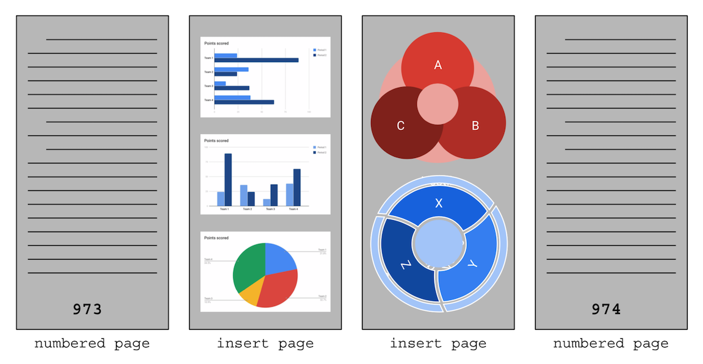

## `preservation` workflow naming template

### examples: ([template details](#template) below)
  * front matter:
    * `nyu_aco123456_fr01_m.tif`
    * `nyu_aco123456_fr01_d.tif`
    * ...
    * `nyu_aco123456_fr157_m.tif`
    * `nyu_aco123456_fr157_d.tif`
  * numbered pages:
    * `nyu_aco123456_000123_m.tif`
    * `nyu_aco123456_000123_d.tif`
  * back matter:
    * `nyu_aco123456_bk97_m.tif`
    * `nyu_aco123456_bk97_d.tif`
    * ...
    * `nyu_aco123456_bk191_m.tif`
    * `nyu_aco123456_bk191_d.tif`
  * inserts:
    * e.g., two insert pages between numbered pages 973 and 974
      * `nyu_aco123456_000973_01_m.tif`
      * `nyu_aco123456_000973_01_d.tif`
      * `nyu_aco123456_000973_02_m.tif`
      * `nyu_aco123456_000973_02_d.tif`
  * oversized numbered pages:
    * e.g., oversized page # 321 requiring 4 `master` files
      * `nyu_aco123456_000321_01_m.tif`
      * `nyu_aco123456_000321_02_m.tif`
      * `nyu_aco123456_000321_03_m.tif`
      * `nyu_aco123456_000321_04_m.tif`
      * `nyu_aco123456_000321_d.tif`
  * oversized insert pages:
    * e.g., oversized, two-sided insert right after page # 722 requiring  
    two `master` files per side
      * `nyu_aco123456_000722_01_01_m.tif`
      * `nyu_aco123456_000722_01_02_m.tif`
      * `nyu_aco123456_000722_01_d.tif`
      * `nyu_aco123456_000722_02_01_m.tif`
      * `nyu_aco123456_000722_02_02_m.tif`
      * `nyu_aco123456_000722_02_d.tif`
  * session target:
    * `nyu_aco123456_target_m.tif`
  * EOC file:
    * `20160324-IQ260-EOC.csv`


#### Please note:   
When using the `preservation` workflow for digitizing `image sets`\, e.g., folders of unbound documents,  
the ["numbered pages" specific template](#specific-templates) should be used because a folder of unbound documents does not  
have front matter or back matter.


### [Link to "Terms Used"](./README.md#terms-used)
### Additional `preservation` workflow terms:
  * **numbered pages**: images of pages that have page numbers printed on them
  * **front matter pages**: images of pages that precede the numbered pages
  * **back matter pages**: images of pages that follow the numbered pages
  * **insert pages**: images of unnumbered pages that appear between numbered pages
  * **oversized numbered pages**: images of large pages that have a page number and require multiple master files to fully image
  * **oversized insert pages**: images of large pages that DO NOT have a page number and require multiple master files to fully image
  
  
  * **oversized pages**: images of pages that require multiple `master` files  
    to capture. The `master` files are stitched together to create a single `dmaker` file  
  

  ### template
  * generic template: <code>&lt;digi_id&gt;<b>\_</b>&lt;sequence number&gt;<b>\_</b>&lt;role&gt;<b>.tif</b></code>
    * `digi_id`: the `digitization id` assigned to the `digital object`
    * `sequence number`: an integer padded with leading-zeros, e.g., `000007`,  
    that indicates the order of the corresponding page in the item
    * `role`: the role of the file, e.g., `master`, `dmaker`
      * use `_m` for `master` files
      * use `_d` for `dmaker` files

#### specific templates
* **numbered pages:**
  * template: <code>&lt;digi_id&gt;<b>\_</b>&lt;page number&gt;<b>\_</b>&lt;role&gt;<b>.tif</b></code>
    * `page number`: a **six digit** integer padded with leading zeros that  
    matches the page number printed on the page
* **front matter pages:**
  * template: <code>&lt;digi_id&gt;<b>\_fr</b>&lt;sequence number&gt;<b>\_</b>&lt;role&gt;<b>.tif</b></code>
    * `sequence number`: a **two digit** integer padded with leading zeros
      * can use three digits when needed
* **back matter pages:**
  * template: <code>&lt;digi_id&gt;<b>\_bk</b>&lt;sequence number&gt;_&lt;role&gt;<b>.tif</b></code>
    * `sequence number`: a **two digit** integer padded with leading zeros
      * can use three digits when needed
* **inserts:**
  * template: <code>&lt;digi_id&gt;<b>\_</b>&lt;page number&gt;<b>\_</b>&lt;insert number&gt;<b>\_</b>&lt;role&gt;<b>.tif</b></code>
    * `page number`: the **six digit** integer padded with leading zeros that  
    matches the last numbered page before the insert
    * `insert number`: a **two digit** integer padded with leading zeros that indicates the sequence number of the page in the "insert" section
      * can use three digits when needed
* **oversized pages:**
  * an oversized page **has a page number** on it
    * `dmaker` template: <code>&lt;digi_id&gt;<b>\_</b>&lt;page number&gt;<b>_d.tif</b></code>
      * `page number`: a **six digit** integer padded with leading zeros that matches the page number on the oversized page
    * `master` template: <code>&lt;digi_id&gt;<b>\_</b>&lt;page number&gt;<b>\_</b>&lt;master file number&gt;<b>\_m.tif</b></code>
      * `page number`: a **six digit** integer padded with leading zeros that matches the page number on the oversized page
      * `master file number`: a **two digit** integer padded with leading zeros that indicates that this master file is part of an oversized page
* **oversized insert pages:**
  * an oversized insert page **DOES NOT have a page number** on it
    * `dmaker` template: <code>&lt;digi_id&gt;<b>\_</b>&lt;page number&gt;<b>\_</b>&lt;insert number&gt;<b>\_d.tif</b></code>
      * `page number`: a **six digit** integer padded with leading zeros that matches the page number on the last numbered page
      * `insert number`: a **two digit** integer padded with leading zeros that indicates the sequence of the page in the "insert" section
        * can use three digits when needed
    * `master` template: <code>&lt;digi_id&gt;<b>\_</b>&lt;page number&gt;<b>\_</b>&lt;insert number&gt;<b>\_</b>&lt;master file number&gt;<b>\_m.tif</b></code>
      * `page number`: a **six digit** integer padded with leading zeros that matches the page number on the last numbered page
      * `insert number`: a **two digit** integer padded with leading zeros that indicates the sequence of the page in the "insert" section
        * can use three digits when needed
      * `master file number`: a **two digit** integer padded with leading zeros that indicates that this master file is part of an oversized page
* **session target:**
  * `master` template: <code>&lt;digi_id&gt;<b>\_target_m.tif</b></code>
  * `dmaker` template: this is not applicable (there are no session target `dmaker` files)
* **EOC file:**
  * the following are valid EOC templates:
    * template: <code>&lt;digitization station name&gt;<b>\-EOC.csv</b></code>
    * template: <code>&lt;digitization station name&gt;<b>_EOC.csv</b></code>
    * template: <code>&lt;digitization station name&gt;<b>_eoc.csv</b></code>
    * template: <code>&lt;digi_id&gt;<b>_eoc.csv</b></code>

### requirements:
* for front matter pages, numbered pages, back matter pages, inserts:
  * every `master` file **MUST** have a corresponding `dmaker` file
* for oversized numbered pages and oversized inserts
  * the multiple `master` files used to capture a single physical oversized page  
    **MUST** be stitched together into one `dmaker` file

* all filenames must be numbered sequentially
    * e.g., 
      ```
      # GOOD
      nyu_aco001311_fr01_m.tif
      nyu_aco001311_fr01_d.tif
      nyu_aco001311_fr02_m.tif
      nyu_aco001311_fr02_d.tif
      nyu_aco001311_fr03_m.tif
      nyu_aco001311_fr03_d.tif
      nyu_aco001311_000001_m.tif
      nyu_aco001311_000001_d.tif
      ...
      nyu_aco001311_000123_m.tif
      nyu_aco001311_000123_d.tif
      nyu_aco001311_000124_m.tif
      nyu_aco001311_000124_d.tif
      nyu_aco001311_000124_01_m.tif
      nyu_aco001311_000124_01_d.tif
      nyu_aco001311_000124_02_m.tif
      nyu_aco001311_000124_02_d.tif
      nyu_aco001311_000125_m.tif
      nyu_aco001311_000125_d.tif
      ...
      nyu_aco001311_bk01_m.tif
      nyu_aco001311_bk01_d.tif
      nyu_aco001311_bk02_m.tif
      nyu_aco001311_bk02_d.tif
            

      # BAD 
      nyu_aco001311_fr01_m.tif
      nyu_aco001311_fr01_d.tif
      nyu_aco001311_fr02_m.tif     # missing dmaker file
      nyu_aco001311_fr03_m.tif
      nyu_aco001311_fr03_d.tif
      nyu_aco001311_000001_m.tif
      nyu_aco001311_000001_d.tif
      ...
      nyu_aco001311_000123_m.tif
      nyu_aco001311_000123_d.tif
      nyu_aco001311_000124_d.tif   # missing master file
      nyu_aco001311_000124_01_m.tif
      nyu_aco001311_000124_01_d.tif
      nyu_aco001311_000124_02_m.tif
      nyu_aco001311_000124_02_d.tif
      nyu_aco001311_000126_m.tif   # missing image files for 000125
      nyu_aco001311_000126_d.tif
      ...
      ```

---
